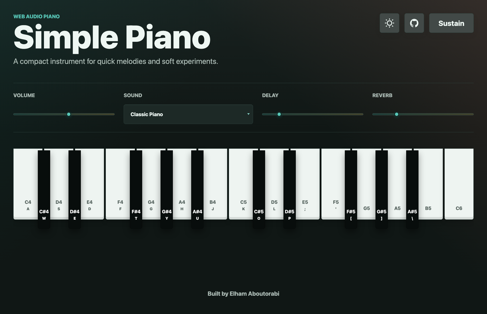

# Simple Piano

A polished browser piano built with plain HTML, CSS, and JavaScript.

## Live App

Play it here: [eliaboutorabi.github.io/simple-piano](https://eliaboutorabi.github.io/simple-piano/)

## Features

- Five sound presets: Classic Piano, Warm Pad, Bright Bell, Retro Synth, and Soft Organ
- Adjustable delay and reverb effects for atmospheric sounds
- Volume and sustain controls
- Light and dark mode with saved theme preference
- Live waveform visualizer powered by the Web Audio output
- Keyboard, mouse, and touch support
- Responsive phone layout with a landscape hint for the full keyboard

## Play locally

Open `index.html` in a browser, or serve the folder with any static file server.

Keyboard mapping:

- White keys: `A S D F G H J K L ; '`
- Black keys: `W E T Y U O P [ ] \`
- Sustain pedal: hold `Space`

The highest keys can also be played by clicking or tapping the on-screen piano.
On phones, portrait mode shows a smaller keyboard; rotate the phone for the full
keyboard.

## Tech Stack

- HTML
- CSS
- JavaScript
- Web Audio API
- GitHub Pages

## Deploy

This repository includes a GitHub Actions workflow that deploys the static site to
GitHub Pages whenever changes are pushed to `main`.

## Link Preview

The app includes Open Graph and Twitter Card metadata that points to
`assets/simple-piano-preview.png`, so shared links show a visual thumbnail instead
of a plain URL.

Built by Elham Aboutorabi.
